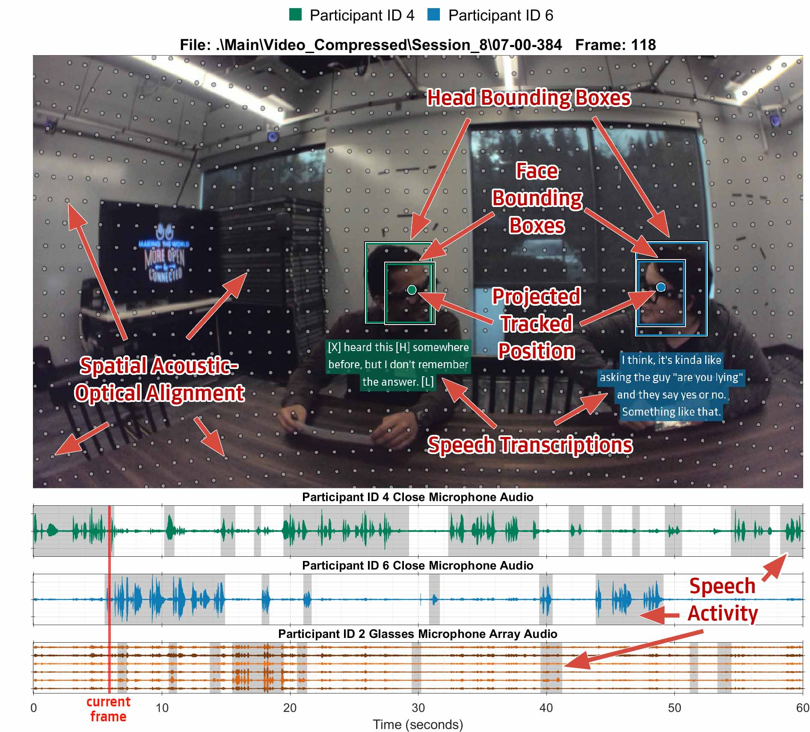

# EasyCom: An Augmented Reality Dataset to Support Algorithms for Easy Communication in Noisy Environments
The Easy Communications (EasyCom) dataset is a world-first dataset designed to help mitigate the *cocktail party effect* from an augmented-reality (AR) -motivated multi-sensor egocentric world view. The dataset contains AR glasses egocentric multi-channel microphone array audio, wide field-of-view RGB video, speech source pose, headset microphone audio, annotated voice activity, speech transcriptions, head and face bounding boxes and source identification labels. We have created and are releasing this dataset to facilitate research in multi-modal AR solutions to the cocktail party problem.


> Figure 1. Example snapshots from the dataset videos

## Content explanation
This dataset is set around natural conversations in a noisy restaurant environment. Participants were equipped with microphones, a camera and tracking markers. They were asked to engage in conversations during several tasks, including introductions, ordering food, solving puzzles, playing games and reading sentences. The participants were exposed to a noisy environment with restaurant-like noise while engaging in conversations. The recordings contain the conversation of all participants and an egocentric video view point of all participants except one. The pose (position and rotation) of every participant was also recorded. The dataset was additionally labelled by annotators with voice activity, speech transcriptions, target of speech assignments and head and face bounding boxes with matching participant IDs.

The collected data comes from two main sensor modalities, namely audio and vision, and includes spatial and temporal information in both modalities to facilitate research in single channel speech enhancement, beamforming, audio-visual speech enhancement, conversational dynamics and more. The provided pose data, headset microphone data and annotations, including the generated head and face bounding boxes, all compliment the main audio and video data for tasks such as model design and analysis.


> Figure 2. Scenario layout for the participants. The participants sit around a table with Participant IDs based on their role or seated location. The circular rings indicate noise sound sources. The sets of Participant IDs are shown for each total number of participants. The AR glasses with egocentric camera and microphone array are indicated by the color-filled glasses.

## Overview of Included Data
The dataset contains the following:
   -  A 6-channel head-mounted microphone array recording.
   -  Egocentric video (Full HD, Wide FOV).
   -  Head pose (6DOF) of each participant.
   -  Headset microphone recordings for each participant (other than the AR glasses wearer).
   -  Participant head-shot photos (other than the AR glasses wearer).
   -  Annotated speech transcription.
   -  Annotated target of speech labels.
   -  Annotated voice activity.
   -  Generated head and face bounding boxes with annotated IDs.

Size/Duration:
   -  5 hours 18 minutes and 11 seconds of high quality data.
   -  6.6 hours total (includes data with errors).
   -  Approximately 30 minute conversational sessions.
   -  1 minute partially continuous data segments during sessions.


> Figure 3. Annotations and labels for an example frame in the dataset. The tracked poses have been projected into the image space.

## Citation
```
@ARTICLE{donley2021easycom,  
   author={Jacob Donley and Vladimir Tourbabin and Jung-Suk Lee and Mark Broyles and Hao Jiang and Jie Shen and Maja Pantic and Vamsi Krishna Ithapu and Ravish Mehra},  
   title={EasyCom: An Augmented Reality Dataset to Support Algorithms for Easy Communication in Noisy Environments},  
   year={2021},  
   eprint={2107.04174},  
   archivePrefix={arXiv},  
   primaryClass={cs.SD}  
}
```

## Downloading
You can download the latest version of the dataset by cloning the repository or by following the instructions on the repository's [releases page](https://github.com/facebookresearch/EasyComDataset/releases).

## Dataset Structure
The dataset contains several high level directories for the data and auxiliary information. The directories and their contents are explained in detail as follows.
  
  
┬── **`Main`** (*directory*): Contains the main dataset.  
│   ├── **`Close_Microphone_Audio`** (*directory*): Contains the close headset microphone  
│   │   │   of the participants for all sessions.  
│   │   └── **`Session_#`** (*directories*): The session directories for close microphone audio.  
│   │        └── `##-##-###_Participant_ID_#.wav` (*files*): Single channel audio  
│   │           wav files for each participants close microphone, except the AR glasses  
│   │           wearer and restaurant server.  
│   ├── **`Face_Bounding_Boxes`** (*directory*): Contains the face bounding boxes for the  
│   │   │   participants in the egocentric video.  
│   │   └── **`Session_#`** (*directories*): The session directories for face bounding boxes.  
│   │        └── `##-##-###.json` (*files*): JSON files containing the face bounding  
│   │           box coordinates, frame numbers and the associated participant IDs.  
│   ├── **`Glasses_Microphone_Array_Audio`** (*directory*): Contains the microphone array  
│   │   │   audio for the AR glasses wearer.  
│   │   └── **`Session_#`** (*directories*): The session directories for AR glasses  
│   │        │   microphone array audio.  
│   │        └── `##-##-###.wav` (*files*): Six channel audio wav files for the AR  
│   │           glasses microphone array.  
│   ├── **`Head_Bounding_Boxes`** (*directory*): Contains the head bounding boxes for the  
│   │   │   participants in the egocentric video.  
│   │   └── **`Session_#`** (*directories*): The session directories for head bounding boxes.  
│   │        └── `##-##-###.json` (*files*): JSON files containing the head  
│   │           bounding box coordinates, frame numbers and the associated  
│   │           participant IDs.  
│   ├── **`Metadata`** (*directory*): Contains metadata files for the sessions.  
│   │   └── `Session_#.txt` (*files*): Metadata text files for the sessions.  
│   ├── **`Participant_Photos`** (*directory*): Contains photos of the participants with  
│   │   │   their associated ID numbers.  
│   │   └── **`Session_#`** (*directories*): The session directories for participant photos.  
│   │        └── `#.png` (*files*): Headshot photos of the participants where the  
│   │           file number is the participant ID.  
│   ├── **`Speech_Transcriptions`** (*directory*): Contains the speech transcriptions and  
│   │   │   voice activity labels.  
│   │   └── **`Session_#`** (*directories*): The session directories for speech  
│   │        │   transcriptions.  
│   │        └── `##-##-###.json` (*files*): JSON files containing text transcriptions  
│   │           of participants speech, the start and end frames of voice activity and  
│   │           labels that mark the target of the speech.  
│   ├── **`Tracked_Poses`** (*directory*): Contains the tracked poses (translation and  
│   │   │   rotation).  
│   │   └── **`Session_#`** (*directories*): The session directories for tracked poses.  
│   │        └── `##-##-###.json` (*files*): JSON files containing the pose  
│   │           information for each participant in cartesian translation and  
│   │           quaternion rotation.  
│   └── **`Video_Compressed`** (*directory*): Contains the compressed egocentric video  
│        │   from the AR glasses wearer.  
│        └── **`Session_#`** (*directories*): The session directories for compressed videos.  
│             └── `##-##-###.mp4` (*files*): MPEG4 video files containing the compressed  
│               video stream from the egocentric view of the AR glasses wearer.  
│  
├── **`Extra`** (*directory*): Contains extra data with minor errors to compliment the main dataset.  
│   ├── **`Close_Microphone_Audio`** (*directory*): Contains the close headset microphone  
│   │   │   of the participants for all extra sessions.  
│   │   └── **`ExtraSession_#`** (*directories*): The extra session directories for close  
│   │        │   microphone audio.  
│   │        └── `##-##-###_Participant_ID_#.wav` (*files*): Single channel audio  
│   │           wav files for each participants close microphone, except the AR  
│   │           glasses wearer and restaurant server.  
│   ├── **`Frame_Drops`** (*directory*): Contains information on the timing of the audio  
│   │   │   frame drops.  
│   │   └── **`ExtraSession_#`** (*directories*): The extra session directories for frame  
│   │        │   drop labels.  
│   │        └── `##-##-###.txt` (*files*): Text files containing the frame number  
│   │           and frame drop count for each audio segment.  
│   ├── **`Glasses_Microphone_Array_Audio`** (*directory*): Contains the microphone array  
│   │   │   audio for the AR glasses wearer.  
│   │   └── **`ExtraSession_#`** (*directories*): The extra session directories for glasses  
│   │        │   microphone array audio.  
│   │        └── `##-##-###.wav` (*files*): Six channel audio wav files for the AR  
│   │           glasses microphone array.  
│   ├── **`Metadata`** (*directory*): Contains metadata files for the extra sessions.  
│   │   └── `ExtraSession_#.txt` (*files*): Metadata text files for the extra sessions.  
│   ├── **`Participant_Photos`** (*directory*): Contains photos of the participants with  
│   │   │   their associated ID numbers.  
│   │   └── **`ExtraSession_#`** (*directories*): The extra session directories for  
│   │        │   participant photos.  
│   │        └── `#.png` (*files*): Headshot photos of the participants where the  
│   │           file number is the participant ID.  
│   ├── **`Tracked_Poses`** (*directory*): Contains the tracked poses (translation and  
│   │   │   rotation).  
│   │   └── **`ExtraSession_#`** (*directories*): The extra session directories for tracked poses.  
│   │        └── `##-##-###.json` (*files*): JSON files containing the pose  
│   │           information for each participant in cartesian translation and  
│   │           quaternion rotation.  
│   └── **`Video_Compressed`** (*directory*): Contains the compressed egocentric video  
│        │   from the AR glasses wearer.  
│        └── **`ExtraSession_#`** (*directories*): The extra session directories for  
│             │   compressed videos.  
│             └── `##-##-###.mp4` (*files*): MPEG4 video files containing the compressed  
│               video stream from the egocentric view of the AR glasses wearer.  
│  
├── **`Calibration`** (*directory*): Contains various calibration data.   
│   ├── **`Acoustic and Optical Calibration Data`** (*directory*): Contains data that relates  
│   │   │   the image/video pixel space to the acoustic space.   
│   │   └── `CalibrationPoints.csv` (*file*): Contains the `X` and `Y` pixel  
│   │       coordinates for a specific azimuth and elevation grid.  
│   ├── **`Array Transfer Functions`** (*directory*): Contains data that describes the  
│   │   │   transfer function across array elements for points on a sphere.  
│   │   └── `Device_ATFs.h5` (*file*): Contains array transfer function's (ATF's) and  
│   │       array impulse responses for the microphone array.  
│   ├── **`Camera Intrinsics Calibration Images`** (*directory*): Contains data that  
│   │   │   relates the local pixel coordinates to global coordinates.  
│   │   └── `*.png` (*files*): Images taken by the egocentric camera containing  
│   │       checkerboards with sizing.  
│   └── **`Tracking Marker Configurations`** (*directory*): Contains data that relates the  
│        │   pose centers to the individual marker locations.  
│        └── `Assets.xml` (*file*): The Optitrack asset file used for the recordings,  
│           which contains the fiducial marker coordinates.  
│  
├── **`readme`** (*directory*): Contains images and other data for the readme file.  
└── `README.md` (*file*): This readme markdown file.  

## Data Split
The following split is our recommendation:

| Data Subset       | Session #                |
| :---:             | :-:                      |
| Train             | `1, 2, 3, 5, 6, 7, 8, 9` |
| Validation        | `4, 12`                  |
| Evaluation / Test | `10, 11`                 |

If you have any questions or concerns with this split, please contact us.

## Further Details on the Data and Structure

### Environment
- Fixed room reverberation time (RT60 of 645ms).
- 10 channel loudspeaker playback of spatially uncorrelated restaurant noise.
- Fixed noise sound pressure level (approximately 71dB SPL).

### File Naming Convention
Each session under the `Main` dataset directory is named with the prefix `Session_` and is followed by an integer number. Each session recording is broken up into one minute segments for all data. The various types of data are separated by their relevant directories one level down from `Main`. All data files are named with time codes in the format `mm-ss-SSS` with the exception of the `Close_Microphone_Audio` data, which is suffixed with `_Participant_ID_` followed by the participant ID number associated with the microphone signal. The time format uses `mm` to represent the two digit minute, `ss` to represent the two digit second and `SSS` to represent the three decimal fractional second. The first file always begins at time code zero, i.e. `00-00-000`. When put together, the data type directory name, the session directory name and the file name are unique identifiers of the file within the `Main` and `Extra` datasets.

The metadata files are named according to the corresponding session directory name. The `Participant_Photos` directory contains image files suffixed with integer numbers between `1` and `7` that correspond to the participant ID for the given session. The participant IDs relate the different types of data within a session for each participant.

### Close Microphone Audio

- Single channel headset close microphone audio signals from all participants except the AR glasses wearer and the restaurant server.
- Sampling rate of 48kHz. (Rate is approximate, see [Notes](#Notes-and-Known-Issues))
- Bit depth of 32bits.

### Face Bounding Boxes

- Face bounding boxes generated with a computer vision algorithm.
- ID labels annotated by humans and refined using tracked pose data.
- Each frame contains a list of participant face bounding boxes and is named `Participants`.
- Each bounding box contains:
   - `Participant_ID` as an integer for the participant ID number.
   - `x1` and `y1` indicating the top left corner of the bounding box.
   - `x2` and `y2` indicating the bottom right corner of the bounding box.

### Glasses Microphone Array Audio

- 6 channel microphone array lossless audio signals from a head worn set of AR glasses.
- Sampling rate of 48kHz.
- Bit depth of 32bits.
- Contains 2 binaural microphones worn at the entrance of the ear canal on the participants.

The order of the microphone channels are as follows:
- Channels 1 to 4 are microphones in the frame of the AR glasses in clockwise positions from a top-down point of view.
- Channels 5 and 6 are the binaural microphone channels. Channel 5 is the left ear and channel 6 is the right ear.


The microphone positions in metric millimeters are: 

| Channel/Mic # | X (mm) | Y (mm) | Z (mm) |
| :---: | :-: | :-: | :-: |
| **1** |  82 |  -5 | -29 |
| **2** |  -1 |  -1 |  30 |
| **3** | -77 |  -2 |  11 |
| **4** | -83 |  -5 | -60 |
| **5** | N/A | N/A | N/A |
| **6** | N/A | N/A | N/A |

The microphone positions are relative to the tracked pose. See [Tracked Poses](#Tracked-Poses) and [Tracking Marker Configurations](#Tracking-Marker-Configurations) below for more information. The positions of the binaural microphones vary with placement in the ear. 

### Head Bounding Boxes

- Head bounding boxes generated with a computer vision algorithm.
- ID labels annotated by humans and refined using tracked pose data.
- Each frame contains a list of participant head bounding boxes and is named `Participants`.
- Each bounding box contains:
   - `Participant_ID` as an integer for the participant ID number.
   - `x1` and `y1` indicating the top left corner of the bounding box.
   - `x2` and `y2` indicating the bottom right corner of the bounding box.

### Compressed Videos

- Egocentric video recorded with a wide-angle lens.
  - Approximate horizontal field of view (FOV) of `120°`, vertical FOV of `66°` and diagonal FOV of `139°`.
- Video resolution of `1920 x 1080`.
- Frame rate of `20` frames per second.
- MPEG4 video compression with the x264 library.
  - `veryslow` preset.
  - Constant Rate Factor (CRF) of `17`.

### Speech Transcriptions and Voice Activity

The speech transcriptions included are human annotated and also contain the voice activity start and end times (frames) as well as a target of speech label.

- All words and numbers are spelled out.
- Coding conventions are used for specific sounds:
  - laughter is labelled as `[L]`.
  - coughing is labelled as `[C]`.
  - throat clear is labelled as `[T]`.
  - unintelligible speech is labelled as `[U]`.
  - hesitations are labelled as `[H]`.
  - interruptions are labelled with `-`.
  - mispronunciations are enclosed with asterisks (e.g. `*cabernet sauvignon*`).
- `Start_Frame` and `End_Frame` indicate the starting and ending frame (time) of the voice or speech activity, respectively.
- `Target_of_Speech` labels the estimated target for the spoken speech as either a participant ID, `Group` (for all participant IDs) or `None` (for no participants).

### Tracked Poses

The tracked poses are recordings from an Optitrack system that contain translation and rotation of participants wearing tracking markers. The restaurant server is the only participant not wearing the tracking markers.

- Each frame contains a list of participant head poses and is named `Participants`.
- Each tracked pose sample contains:
   - `Participant_ID` as an integer for the participant ID number.
   - `Position_X`, `Position_Y` and `Position_Z` as the three dimensional cartesian coordinates in metric meters.
   - `Quaternion_X`, `Quaternion_Y`, `Quaternion_Z` and `Quaternion_W` as the quaternion rotation.
   - `isUpSideDown` as an indicator of an upside-down pose (occurs < 1% of the time).

From the perspective of the participant wearing the camera, the coordinate system is oriented as follows:
- Positive `Position_X` points left
- Positive `Position_Y` points upwards
- Positive `Position_Z` points forwards

The origin for the pose data is at the leg of the table on the ground to the immediate left, as viewed from the participant wearing the camera when looking forward.

### Participant Photos
Each participant in the field of view of the ego centric camera had a headshot photo taken prior to recording. The file names are labelled according to the participant ID and can be considered the source of truth for the participant IDs as used across the dataset. The images are all lossless `.png` files and are taken at the same resolution as the video.

### Metadata

There is a metadata file associated with each recording session and contains the following additional information:
- `Frames Per Second`
- `Audio Data Type`
- `Audio Channels in Video`
- `Audio Compressor`
- `Camera Format`
- `Camera Data Type`
- `Camera Exposure`
- `Camera Gain`
- `Video Resolution`
- `Room Setting`
- `Optitrack Calibration Quality`
- `Optitrack Continuous Calibration`

### Frame Drops
The extra sessions are provided in addition to the standard dataset, however, there are various errors and frame drops throughout the extra sessions. The time location (in frames) of the audio frame drops are labelled in the text files along with the number of dropped frames at that time.

## Further Details on the Calibration Data
### Acoustic and Optical Calibration Data
A comma delimited file (`.csv`) is provided and contains data that relates the image/video pixel space to the acoustic space.
The `CalibrationPoints.csv` file lists the image/video pixel coordinates in `X` (horizontal) and `Y` (vertical) for a set of `Azimuth` and `Elevation` pairs that sample a sphere. The grid is separated by 3 degree increments in both azimuth and elevation.

### Array Transfer Functions
An HDF5 file is provided and contains multiple HDF5 datasets related to describing the array transfer function across microphone elements for a set of points on a sphere. The HDF5 datasets are the following:
- `DimensionNames`: A string describing the ordering of dimensions of the `IR`, `RealTF` and `ImagTF` data in the HDF5 file.
- `IR`: A three dimensional array containing array impulse response time samples for each microphone and source channel pair.
- `RealTF`: The real part of the complex Fourier transform of the array impulse responses contained in `IR`. The first element is the DC component and the last element is the Nyquist frequency component.
- `ImagTF`: The imaginary part of the complex Fourier transform of the array impulse response contained in `IR`. The first element is the DC component and the last element is the Nyquist frequency component.
- `Theta`: The polar angle with respect to the polar axis (zero is pointing upwards from the head).
- `Phi`: The azimuthal angle of rotation from the meridian plane (zero is pointing forwards from the head).


- `SweepType`: The type of sweep for the impulse response excitation signal.
- `SweepLength_s`: The length of the impulse response excitation signal.
- `SamplingFreq_Hz`: The sampling frequency (rate) in Hertz of the impulse responses and transfer functions.
- `SweepLowerFreq_Hz`: The lower frequency bound in Hertz of the impulse response excitation signal.
- `SweepUpperFreq_Hz`: The upper frequency bound in Hertz of the impulse response excitation signal.
- `StartingTemp_F`: The temperature in Fahrenheit at the beginning of the impulse response measurement procedure.
- `EndingTemp_F`: The temperature in Fahrenheit at the end of the impulse response measurement procedure.

The order of the microphone channels are the same as those in `Glasses Microphone Array Audio`.

### Camera Intrinsics Calibration Images
Multiple checkerboard image files are provided to aid in calibrating the intrinsics of the camera used for recording the egocentric video. The `.png` files named from `1` to `7` can be used for intrinsics calibrations and lens dewarping. The file suffixed with `Checkerboard Image Size` shows the size of the checkerboard pattern. A pre-calibrated intrinsics matrix is provided in `Camera_Intrinsics_Parameters_K.txt`.

### Tracking Marker Configurations
The `Asset.xml` file is included from the Optitrack Motive software package. The participants wore glasses that were the rigid bodies with markers. In the XML file, the glasses are the elements named `rigid_body` with child element `markers` containing the individual `marker` elements, which describe the fiducial marker positions. The marker positions can be found as the content of the `position` element in the form `x,y,z`. Each pose that is tracked is the centroid of its corresponding marker positions.

The `rigid_body` element also contains a child element named `properties` containing several `property` elements with further information about the particular rigid body. The rigid body `property` element with the child element `name` that contains the content `NodeName` is the `property` describing the rigid body's name, which is found as the content under the element `value`. The rigid body names are similar to the participant IDs but are not the same. The rigid body names are labelled as `Glasses` and `Participant#`, where `#` is from `1` to `4` and is incremented for each participant from left to right of the AR glasses wearers point of view.

## Notes and Known Issues
- Some sessions do not contain consecutive one minute data segments due to some one minute data segments being redacted.
- The videos of the `Main` dataset in `Session_8` under `Video_Compressed` have an incorrect Participant ID banner embedded on the left side. The correct Participant IDs can be found under the `Participant_Photos` directory. The right edge of the banner is found by subtracting `1920` from the total video width, after which the banner can be ignored.
- Some pose estimates rotate upside-down at times (occurs < 1% of the time), which is caused by a loss of marker tracking (e.g. caused by a covered/occluded marker).
- There is a typo in the metadata files where `Audio Channels in Video` should be `[5 6]`.
- The sampling rate of the `Close Microphone Audio` is approximately 48008.6Hz and varies slightly between sessions (&pm;0.5Hz).
- The first video frame is numbered 1 for the face bounding boxes and 0 for the head bounding boxes. Each video has a maximum of 1200 frames.

## Contact
Please email Jacob Donley and Vladimir Tourbabin at [EasyComDataset@fb.com](mailto:EasyComDataset@fb.com).

## License
Creative Commons Attribution Non-Commercial 4.0 International public license agreement ([CC-BY-NC-4.0](https://creativecommons.org/licenses/by-nc/4.0/)). See [LICENSE](https://github.com/facebookresearch/EasyComDataset/blob/main/LICENSE) for details.
